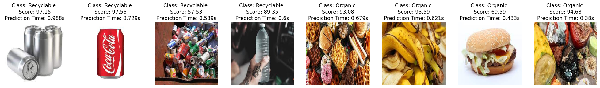

# Waste_Classification

Image Classification project.

--------------------------------------------------------------------------------------------------------

# Project Details:

Task:			Take an image and classify it as Recyclable or Organic

Accuracy:		93%

Prediction time:	0.2s to 0.5s

--------------------------------------------------------------------------------------------------------
# Outlines:

- Loading and processing data
- Loading data into the pipeline
- Visualizing Data
- Split a small data set for tuning
- Model Building
	- Choosing the best model architecture
	- Hyperparameter tuning
	- Train
	- Evaluation
	- Plot confusion matrix
	- Visualize the misclassified images
	- Testing the model using images downloaded from the internet
-------------------------------------------------------------------------------
# Images Classified using the model

